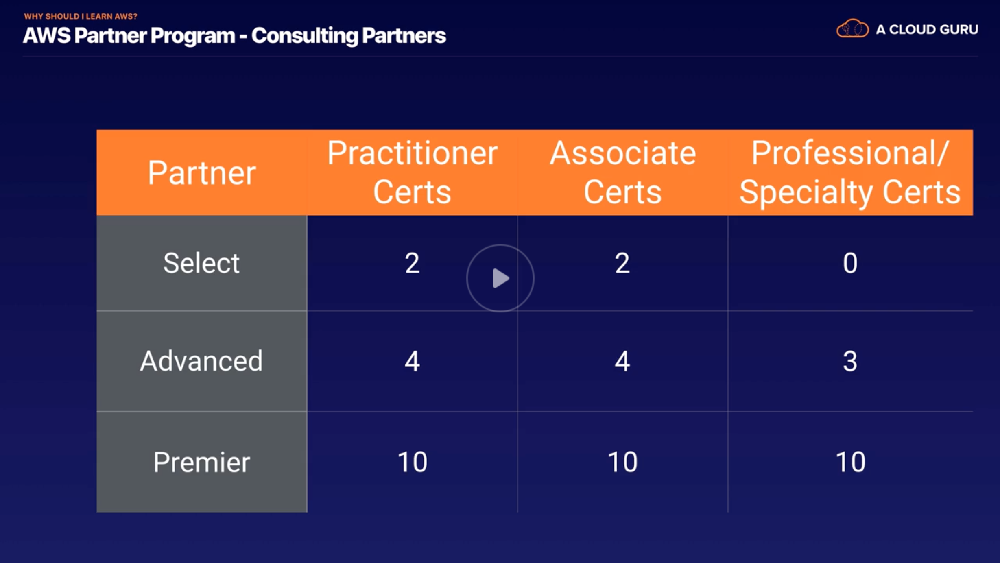
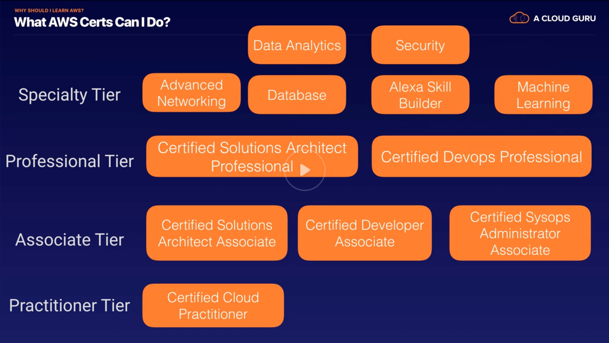
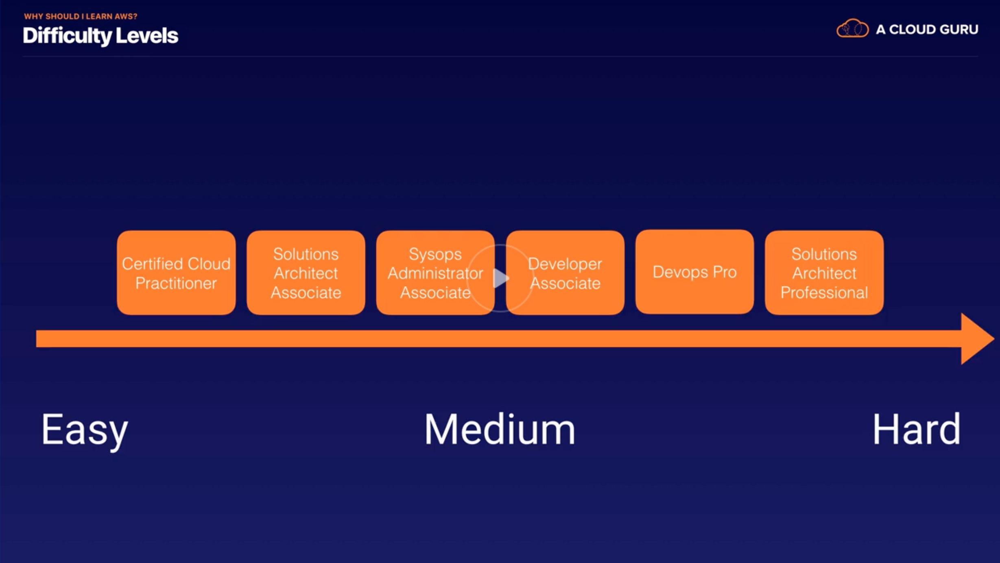

# [AWS Certified Solutions Architect Associate 2020](https://learn.acloud.guru/course/aws-certified-solutions-architect-associate/dashboard)

## Introduction

### Exam Blueprint

- Blueprint
  - 130 minutes
  - 65 questions
  - Multiple choice
  - Results are between 100 and 1000. Passing: 720. Aim for 70%.
  - Valid for 3 years now.
  - Scenario-based questions.
- aws.amazon.com/certification/certified-solutions-architect-associate
  - www.aws.training/certification
    - May want to use work email in order to link to organization. (Or more flexibility when using own.)
    - Note: Digital badges
  - Schedule New Exam > aws.psiexams.com
- Registration: \$150

### Why Should I Learn AWS?

- Ryan Kroonenberg
  - Was an immigration layer.
  - But global financial crisis led to decreased demand in specialized lawyer services.
  - Got MCSE & CCNA.
- ACG
  - 1.5 million students and counting.
  - Acquired Linux Academy in December 2019.
  - Largest cloud computing library in the world.
  - Will be able to spin up AWS environments at the click of a button.
- 
- 
  - No longer anyd pre-requisite associate exams.
- 

## AWS - 10k Foot Overview

## IAM & S3

## EC2

## Databases

## Route53

## VPCs

## HA

## Applications

## Serverless

## Good Luck
